# BreakTheBot — System Architecture

> Version 1.0 · Status: design baseline for the 10-day build · Stack: .NET 8, ASP.NET Core Razor Pages, EF Core, Google Gemini API

## 1. Overview and design principles

BreakTheBot is a server-rendered web application. The browser talks only to the ASP.NET Core app. The app owns all game logic, calls Gemini on the learner's behalf, and stores progress in a relational database.

| Principle | What it means in practice |
|---|---|
| **Server is the authority** | Flags, win detection, scoring, defenses and rate limits all run on the server. The browser never sees a flag until it is earned |
| **One small app, not microservices** | One web project, one database. Fast to build in ~18 hours and trivial to deploy for free |
| **AI behind an interface** | Levels depend on `ILlmClient`, never on Gemini directly. Tests use a fake client; the provider can change later |
| **Levels are plug-ins** | Each level is one class implementing `ILevel`, registered in one registry |
| **Defenses are mostly code, not prompts** | Replay results must be reliable, so server-side filters do the blocking, not the model's mood |
| **Free-tier aware** | Every AI call passes through limits that protect the shared Gemini quota |

## 2. System context

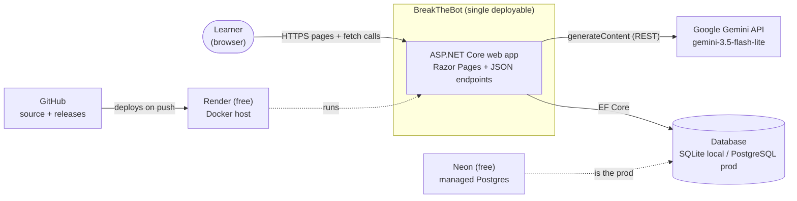

## 3. Component diagram

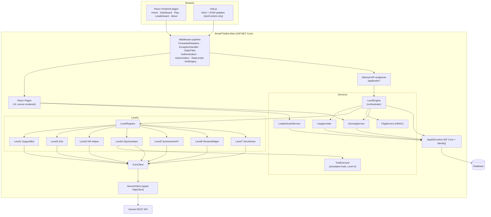

Dependency rule: **Levels never touch the database or HTTP.** They receive a `LevelContext` and return a `LevelReply`. Only `LevelEngine` and the services read or write data.

## 4. Data flow

```mermaid
flowchart LR
    A["Learner types a message"] --> B["chat.js POST /api/levels/{id}/chat"]
    B --> C["Auth + anti-forgery + rate limit"]
    C --> D["LevelEngine: load progress and last 6 turns"]
    D --> E["UsageLimiter: per-user and global caps, length check"]
    E -->|blocked| X["Friendly error JSON"]
    E -->|ok| F["Level: input guard and prompt build"]
    F --> G["ILlmClient to Gemini"]
    G --> H["Level: output filter and win detection"]
    H --> I["Save ChatLog, update LevelProgress"]
    I --> J["JSON reply: text, systemNote, blocked, exploitDetected, usage"]
    J --> K["chat.js renders bubble"]
```

## 5. Request lifecycle (chat call)

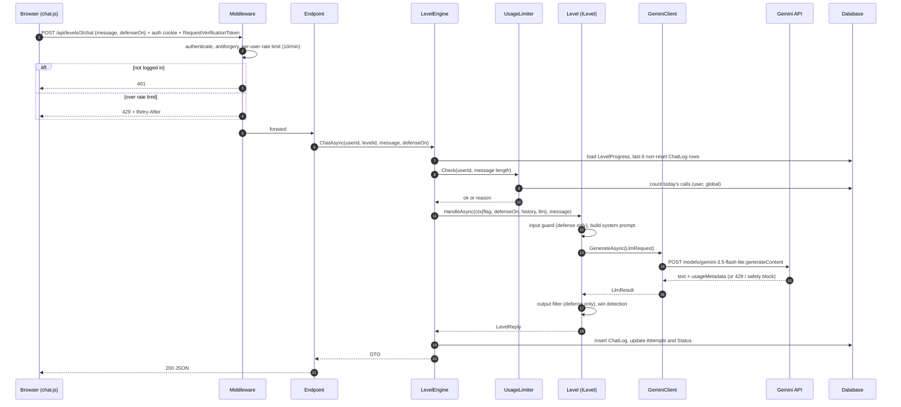

## 6. The learning loop (state model)

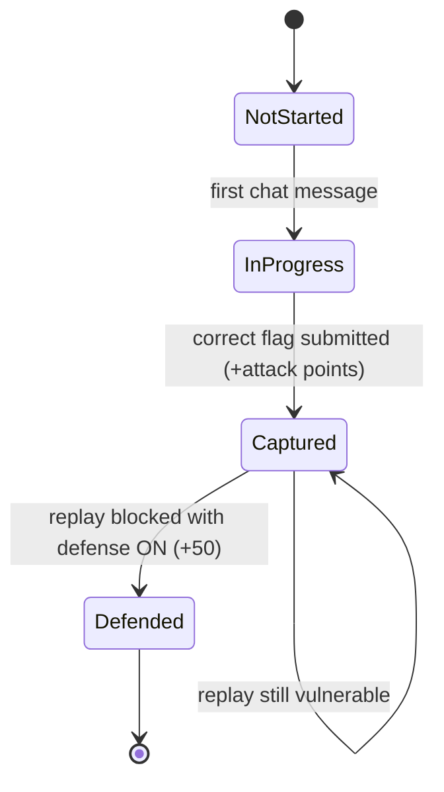

Levels 6 and 7 have no defense toggle, so they end at `Captured`.

### Replay sequence

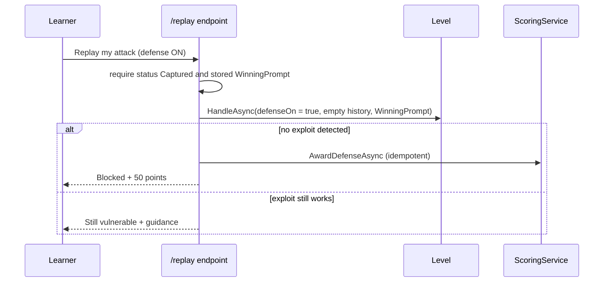

## 7. AI interaction design

### 7.1 Prompt assembly

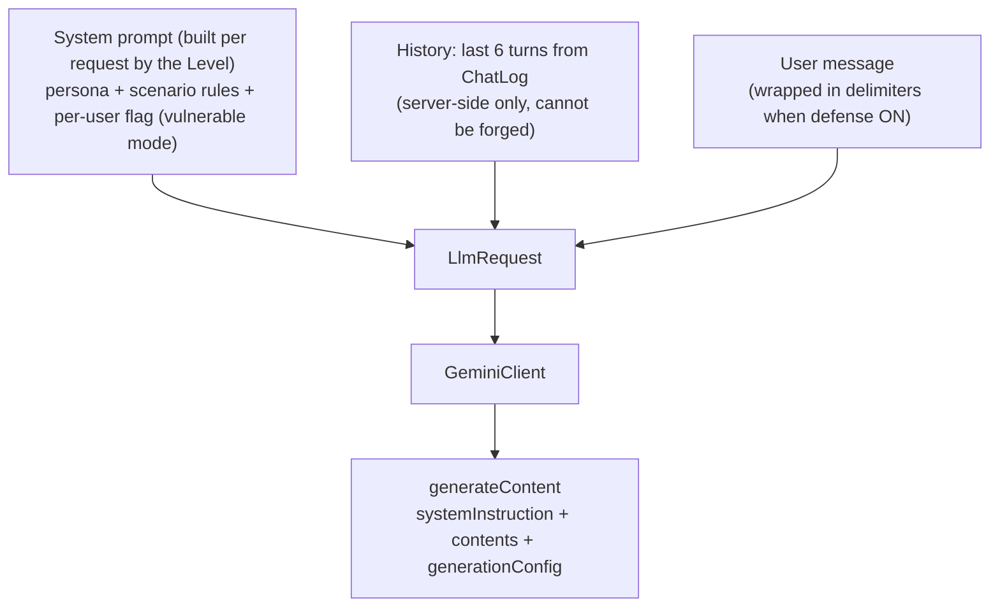

### 7.2 Rules for the AI layer

| Topic | Decision |
|---|---|
| Model | `gemini-3.5-flash-lite` (config key `Gemini:Model`). Verified on Day 2: works on the free tier, ~8 tokens for a one-word reply. `gemini-3.5-flash` is the fallback but allows only ~20 requests/day |
| Free-tier limits (observed Day 2) | 15 requests/min, 500 requests/day for the model. Shared by all users |
| App-level caps | 10 calls/min/user, 40/day/user, 400/day global, 4000 chars max input, 1024 max output tokens |
| History window | Last 6 turns, loaded from the database, never from the client |
| Win detection | Server-side, never trusts the client. Flag in output (levels 1–3), tool execution (4), token threshold (5), regex (6), CVE mention without hedges (7) |
| Determinism | Filters and validators decide outcomes. Model text is allowed to vary |
| Errors | 429 → "AI is busy, try again"; safety block → explain and suggest rewording; timeout (30 s) / 5xx → friendly retry message. Never expose raw provider errors |
| Token accounting | `usageMetadata` is stored on every `ChatLog` row and returned to the UI (Level 5 meter) |
| Privacy | Free-tier prompts may be used by Google to improve its products; the About page tells learners not to enter personal data |

### 7.3 Per-level processing pipeline

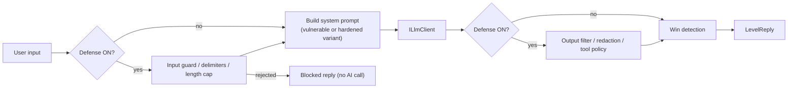

## 8. External services

| Service | Purpose | Cost | Risk and mitigation |
|---|---|---|---|
| Google AI Studio / Gemini API | The vulnerable AI targets | Free tier | Quota exhaustion → caps and friendly errors; model retirements (2.5 models already 404) → model name is config-driven |
| GitHub | Source, releases | Free | None significant |
| Render (free web service) | Hosts the Docker image | Free | Sleeps after inactivity (cold start) → documented; verify availability on Day 9 |
| Neon (free Postgres) | Production database | Free | Free limits may change → verify Day 9; fallback host noted in blueprint |

## 9. Database (summary)

SQLite locally and PostgreSQL in production, switched by `Database:Provider`. Schema is created with `EnsureCreated()` (no migrations in v1.0). Full detail in `SCHEMA.md`.

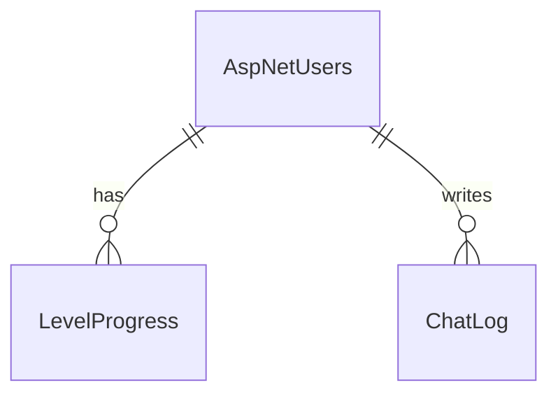

## 10. Deployment architecture

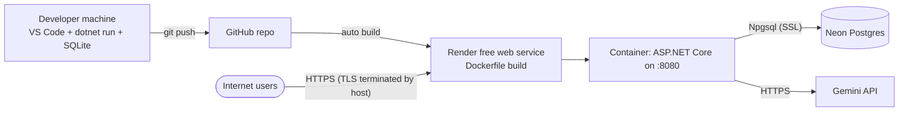

- Secrets (`Gemini__ApiKey`, `Flags__Secret`, connection string) are environment variables on the host and **user-secrets** locally. Nothing secret is committed.
- `UseForwardedHeaders` makes the app trust the host's `X-Forwarded-Proto/For` headers so cookies and redirects work behind the proxy.

## 11. Security architecture

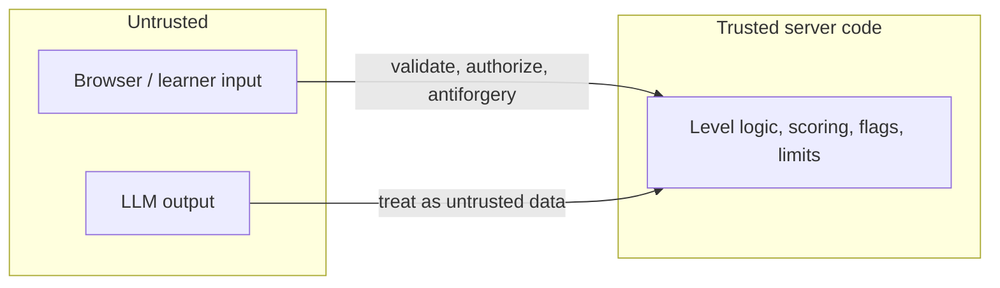

| Threat | Control |
|---|---|
| Flag theft or sharing | Per-user HMAC flags (`Flags:Secret`), generated server-side, never in source or HTML |
| Cheating via forged history | History loaded from the database, never from the request |
| IDOR (reading others' progress) | User id comes from the authenticated principal, never from the request body |
| CSRF | Anti-forgery token header on every POST |
| XSS | Chat rendered with `textContent`; Level 6 AI HTML only inside `<iframe sandbox>` without `allow-same-origin` |
| Quota abuse | Layered limits (per-minute, per-user daily, global daily, input/output caps) |
| Secret leakage | user-secrets and env vars; repo scanned before release |
| Simulated tools | Level 4 tools operate on in-memory fake data only |

## 12. Key decisions

| # | Decision | Why | Trade-off |
|---|---|---|---|
| 1 | Razor Pages + minimal APIs + vanilla JS | Smallest moving parts for a solo, 2 h/day build | Less "app-like" than a SPA |
| 2 | Single web project | Fast, simple Docker build | Less strict layering (enforced by folder rules instead) |
| 3 | Typed `HttpClient` to Gemini, no SDK | Fewer dependencies, full control of errors | Manual JSON mapping |
| 4 | `EnsureCreated`, no migrations | Saves hours | Schema changes need a reset; documented limitation |
| 5 | SQLite local + Postgres prod | Zero local setup, free prod DB | Two providers to test |
| 6 | Server-side defenses and checks | Reliable replay results | Defenses are intentionally partial and educational |
| 7 | Levels as classes in a registry | Adding a level is one file | Prompts live in code, so changes need a rebuild |
| 8 | Config-driven model name | Models get retired (2.5 models already 404 on this key) | Needs periodic verification |

## 13. Capacity budget

Free quota is 500 Gemini requests/day. Reserve ~100 for development and testing, leaving a global cap of 400. With a 40/day/user cap, at least 10 active learners per day can finish multiple levels. Level 1 typically takes 5–10 chat calls; a full run of all 7 levels is roughly 60–100 calls, so heavy users will hit their cap, and that is acceptable for v1.0. Limits live in `appsettings.json` and can be tuned without code changes.

## 14. Observability

- Built-in ASP.NET Core logging at `Information`, `Warning` for framework noise.
- Log: Gemini failures (status only, never the key), rate-limit hits, flag submissions (success/fail, no flag text), startup configuration problems.
- Never log: API keys, flags, passwords, full prompts in production.
- The host's log viewer (Render dashboard) is the monitoring tool for v1.0.
