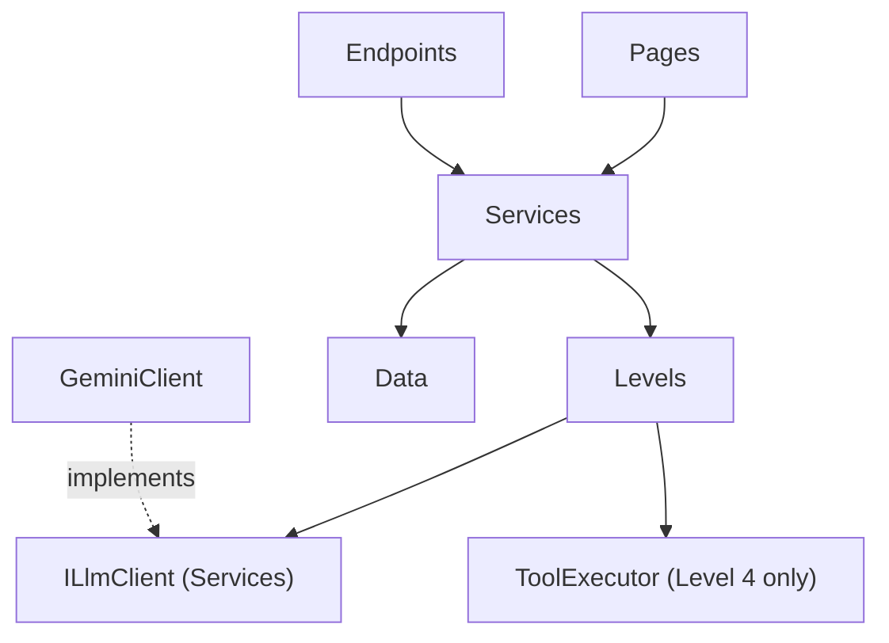

# BreakTheBot — Project Structure

> Version 1.0 · Legend: ✅ exists after Day 2 · 🔜 planned (day shown) · Target framework: net8.0

## 1. Full folder tree

```
BreakTheBot/                              ← repository root (C:\Projects\BreakTheBot)
├─ BreakTheBot.sln                        ✅ solution (groups web + tests)
├─ README.md                              🔜 Day 9   public front page of the repo
├─ LICENSE                                🔜 Day 9   MIT
├─ Dockerfile                             🔜 Day 9   builds the production image
├─ .dockerignore                          🔜 Day 9
├─ .gitignore                             ✅ keeps bin/obj/*.db/secrets out of Git
│
├─ docs/                                  ✅ all documentation
│  ├─ ARCHITECTURE.md                     ← design documents (this set)
│  ├─ SCHEMA.md
│  ├─ API.md
│  ├─ UI-WIREFRAMES.md
│  ├─ PROJECT-STRUCTURE.md
│  ├─ planning/                           ← PRD, implementation blueprint, pitch deck
│  ├─ screenshots/                        ← images used by README and posts
│  └─ linkedin/                           ← daily post drafts
│
├─ src/
│  └─ BreakTheBot.Web/                    ✅ the one deployable web project
│     ├─ BreakTheBot.Web.csproj           ✅
│     ├─ Program.cs                       ✅ app startup: services, middleware, endpoints
│     ├─ appsettings.json                 ✅ non-secret defaults (model, limits)
│     ├─ appsettings.Development.json     ✅
│     │
│     ├─ Data/                            🔜 Day 3   persistence
│     │  ├─ AppDbContext.cs                 EF Core + Identity context
│     │  ├─ LevelProgress.cs                entity + LevelStatus enum
│     │  └─ ChatLog.cs                      entity
│     │
│     ├─ Services/                        🔜 Day 3–8 application logic (no UI, no prompts)
│     │  ├─ ILlmClient.cs                   AI contract and records
│     │  ├─ GeminiClient.cs                 the only class that calls Gemini
│     │  ├─ FlagService.cs                  per-user HMAC flags
│     │  ├─ ScoringService.cs               attack/defense points, idempotent
│     │  ├─ UsageLimiter.cs                 per-user and global daily caps
│     │  ├─ LevelEngine.cs                  orchestrates one chat/replay call
│     │  ├─ ToolExecutor.cs                 simulated tools for Level 4
│     │  └─ LeaderboardService.cs           top-10 query
│     │
│     ├─ Levels/                          🔜 Day 4–7 one class per level (the "content")
│     │  ├─ ILevel.cs                       contract + LevelContext/LevelReply records
│     │  ├─ LevelBase.cs                    shared helpers (flag matching, guards)
│     │  ├─ LevelRegistry.cs                list of all levels, GetById
│     │  ├─ Level1SupportBot.cs
│     │  ├─ Level2Aria.cs
│     │  ├─ Level3HrHelper.cs
│     │  ├─ Level4OpsAssistant.cs
│     │  ├─ Level5SummarizeApi.cs
│     │  ├─ Level6ReviewWidget.cs
│     │  └─ Level7SecAdvisor.cs
│     │
│     ├─ Endpoints/                       🔜 Day 4–5 JSON API
│     │  └─ LevelEndpoints.cs               chat, flag, hint, replay, reset
│     │
│     ├─ Pages/                           ✅ Razor Pages (server-rendered UI)
│     │  ├─ Index.cshtml / .cs              ✅ home with 10 OWASP cards
│     │  ├─ Dashboard.cshtml / .cs          🔜 Day 4
│     │  ├─ Leaderboard.cshtml / .cs        🔜 Day 8
│     │  ├─ About.cshtml / .cs              🔜 Day 8
│     │  ├─ Error.cshtml / .cs              ✅ template; customized Day 8
│     │  ├─ Levels/
│     │  │  └─ Play.cshtml / .cs            🔜 Day 4–5 the level screen
│     │  ├─ Shared/
│     │  │  ├─ _Layout.cshtml               ✅ dark layout and navbar
│     │  │  ├─ _LoginPartial.cshtml         🔜 Day 3
│     │  │  └─ _ValidationScriptsPartial.cshtml ✅
│     │  ├─ _ViewImports.cshtml             ✅
│     │  └─ _ViewStart.cshtml               ✅
│     │
│     ├─ Areas/Identity/                  🔜 Day 3 (only if scaffolded pages are needed)
│     │
│     └─ wwwroot/                         ✅ static files served as-is
│        ├─ css/site.css                    ✅ theme and component styles
│        ├─ js/chat.js                      🔜 Day 4 chat UI logic
│        ├─ js/site.js                      ✅ template file
│        └─ lib/                            ✅ Bootstrap, jQuery (from template)
│
└─ tests/
   └─ BreakTheBot.Tests/                  ✅ xUnit project (references the web project)
      ├─ FakeLlmClient.cs                 🔜 Day 4  scripted AI replies for tests
      ├─ FlagServiceTests.cs              🔜 Day 3
      ├─ ScoringServiceTests.cs           🔜 Day 3
      ├─ UsageLimiterTests.cs             🔜 Day 4
      ├─ Level1Tests.cs … Level7Tests.cs  🔜 Day 4–7  win detection and defenses
      ├─ ToolExecutorTests.cs             🔜 Day 6
      └─ LeaderboardTests.cs              🔜 Day 8
```

## 2. What each folder is responsible for

| Folder | Responsibility | Must NOT contain |
|---|---|---|
| `Data/` | Entities, `DbContext`, indexes | Business rules, AI calls |
| `Services/` | Reusable application logic: AI client, flags, scoring, limits, orchestration, leaderboard | HTML, level prompts and story text |
| `Levels/` | Everything specific to one challenge: prompt, hints, explanation, defense behavior, win detection | Database access, HTTP calls, direct Gemini code |
| `Endpoints/` | HTTP surface for `chat.js`: validation, auth, mapping DTOs | Business rules (delegates to `LevelEngine`) |
| `Pages/` | Screens: markup and light page models | Game logic (calls services) |
| `Pages/Shared/` | Layout and reusable partials | Page-specific markup |
| `wwwroot/` | CSS, JS, vendor libraries | Server code, secrets |
| `tests/` | Automated tests, fake AI client | Production code |
| `docs/` | Design docs, screenshots, post drafts | Secrets, large binaries |

## 3. Dependency rules (who may call whom)



1. **Levels depend only on `ILlmClient` (and `ToolExecutor` for Level 4).** They never use `AppDbContext` or `HttpClient`.
2. **Only `LevelEngine` writes `ChatLog` and `LevelProgress`** (via `ScoringService` for points).
3. **Only `GeminiClient` knows Gemini's JSON format.**
4. **Pages and endpoints contain no scoring or win logic.**
5. If a rule is broken, the code probably belongs in a different folder.

## 3b. Where future code goes

| If you want to… | Put it in… |
|---|---|
| Add a new level (e.g. LLM03) | New `Levels/Level8….cs`, register it in `LevelRegistry`, add tests |
| Change a level's prompt, hints or explanation | That level's file in `Levels/` |
| Change AI provider or model | New class implementing `ILlmClient` in `Services/`; change DI registration or `Gemini:Model` |
| Add a new API endpoint | `Endpoints/` (and update `docs/API.md`) |
| Add a new page | `Pages/` (and add a nav link in `_Layout.cshtml`) |
| Change colors or spacing | `wwwroot/css/site.css` (tokens at the top) |
| Add a database field or table | `Data/` (and `docs/SCHEMA.md`; reset DB since no migrations) |
| Add a limit or setting | `appsettings.json` + the service that reads it |
| Add a test | `tests/BreakTheBot.Tests/` mirroring the class name |
| Add a screenshot or doc | `docs/` |

## 4. Why this structure

| Choice | Reason |
|---|---|
| One web project instead of many layers | Solo builder, ~2 hours a day: fewer projects means faster builds, simpler Docker, less ceremony |
| Folders enforce layering | You get most of the benefit of clean architecture without extra assemblies |
| `Levels/` is separate from `Services/` | Game *content* changes often and independently from infrastructure; adding a level becomes copy-and-adapt |
| AI behind `ILlmClient` | Testable without spending quota; provider and model can change; protects against retired models |
| `Endpoints/` separate from `Pages/` | Pages render HTML; endpoints serve JSON for chat. Different concerns and different security checks |
| Tests mirror source names | Easy to find the test for any class |
| `docs/` inside the repo | Documentation is versioned with the code, visible on GitHub, and each daily AI chat can read it |
| `wwwroot/js/chat.js` as plain JS | No build tooling, nothing to install, easy to debug |

## 5. Naming and coding conventions

- Namespaces follow folders: `BreakTheBot.Web.Services`, `BreakTheBot.Web.Levels`, etc.
- One public type per file; file name equals type name.
- Level classes: `Level{N}{Codename}` (`Level1SupportBot`). Level ids match numbers 1–7.
- Interfaces start with `I`; async methods end with `Async`; use `CancellationToken` on I/O calls.
- Configuration keys use `Section:Key` (`Gemini:Model`, `Limits:PerDayGlobal`); environment variables use `__` (`Gemini__Model`).
- Nullable reference types stay enabled; no secrets in source, ever.
- CSS class prefix `btb-` for project styles; colors only through CSS variables.

## 6. Configuration and secrets map

| Setting | Where (local) | Where (production) |
|---|---|---|
| `Gemini:ApiKey` | `dotnet user-secrets` | Host env var `Gemini__ApiKey` |
| `Flags:Secret` | `dotnet user-secrets` | Host env var `Flags__Secret` |
| `ConnectionStrings:Default` | `appsettings.json` (SQLite file) | Host env var `ConnectionStrings__Default` (Neon) |
| `Database:Provider` | `appsettings.json` = `Sqlite` | Host env var `Database__Provider=Postgres` |
| `Gemini:Model`, `Limits:*` | `appsettings.json` | Same file, overridable by env vars |

## 7. Build-order map (what lands when)

| Day | Folders touched |
|---|---|
| 2 | solution scaffold, `Pages/Index`, `Pages/Shared/_Layout`, `wwwroot/css`, `appsettings.json`, `docs/` |
| 3 | `Data/`, `Services/FlagService`, `Services/ScoringService`, Identity, `_LoginPartial`, first tests |
| 4 | `Services/` (AI, limits, engine), `Levels/` framework + Level 1, `Endpoints/`, `Pages/Dashboard`, `Pages/Levels/Play`, `wwwroot/js/chat.js` |
| 5 | Endpoints completed, Level 1 defense, Level 2 |
| 6 | Levels 3–4, `ToolExecutor` |
| 7 | Levels 5–7 |
| 8 | `LeaderboardService`, `Pages/Leaderboard`, `Pages/About`, `Pages/Error`, security pass, tests |
| 9 | `Dockerfile`, `.dockerignore`, `README.md`, `LICENSE`, deployment config |
| 10 | Docs, screenshots, release notes |

## 8. Repository hygiene

- `.gitignore` excludes `bin/`, `obj/`, `*.db`, user-specific files and anything secret.
- Commit at the end of every build day with a message like `Day 3: accounts, data model, flags`.
- Tag releases: `v0.9` (feature complete), `v1.0.0` (launch).
- Never commit: API keys, the flag secret, connection strings with passwords, local databases.
