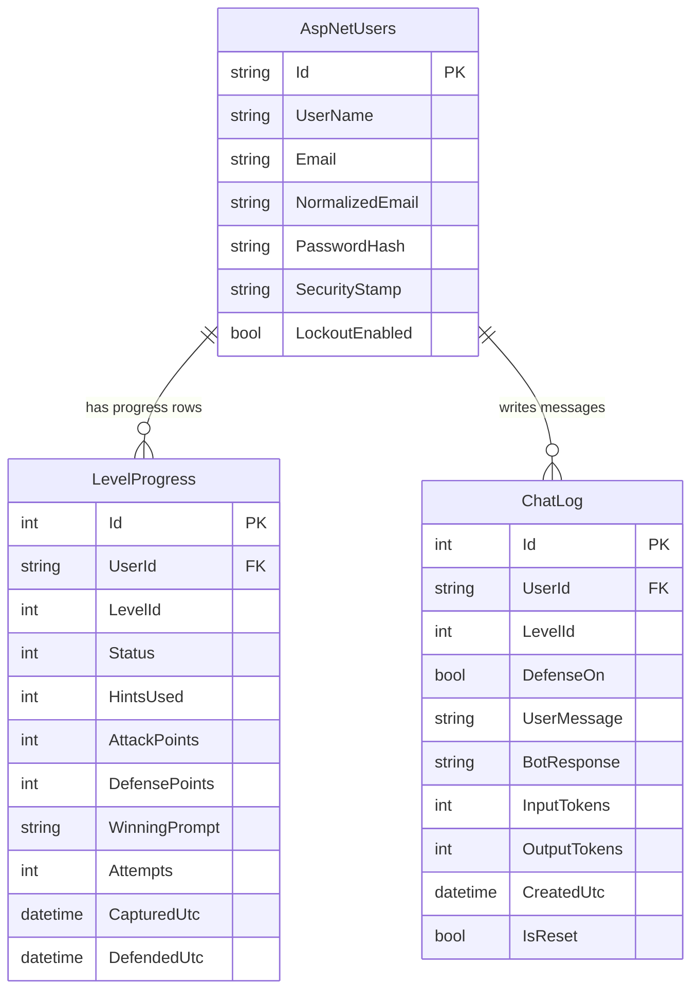

# BreakTheBot — Database Schema

> Version 1.0 · ORM: EF Core · Providers: SQLite (local), PostgreSQL via Npgsql (production) · Creation: `Database.EnsureCreated()` (no migrations in v1.0)

## 1. Design notes

- The database stores **people, progress and chat history only**. Level definitions, prompts, hints and explanations live **in code** (`Levels/*`), not in the database.
- **Flags are never stored.** They are derived per user and level: `FLAG{L{level}_{first 12 hex of HMAC-SHA256(Flags:Secret, userId + ":" + levelId)}}`.
- Identity tables are created by ASP.NET Core Identity; we add two tables of our own.
- The schema works identically on SQLite and PostgreSQL (no provider-specific types).

## 2. Entity-relationship diagram



`AspNetUsers` is the standard Identity table, using the built-in `IdentityUser` class (no custom user class). The other Identity tables (`AspNetRoles`, `AspNetUserRoles`, `AspNetUserClaims`, `AspNetUserLogins`, `AspNetUserTokens`, `AspNetRoleClaims`) are created automatically and unused by v1.0.

## 3. Table definitions

### 3.1 `LevelProgress`

One row per user per level. Created on the first chat message to that level.

| Column | Type | Null | Default | Notes |
|---|---|---|---|---|
| `Id` | int, identity | no | auto | Primary key |
| `UserId` | string (max 450) | no | | FK → `AspNetUsers.Id`, cascade delete |
| `LevelId` | int | no | | 1–7. Matches `ILevel.Id` in code |
| `Status` | int (enum `LevelStatus`) | no | 0 | See enum below |
| `HintsUsed` | int | no | 0 | 0–2 |
| `AttackPoints` | int | no | 0 | Set once on flag capture: `max(50, 100 − 10 × HintsUsed)` |
| `DefensePoints` | int | no | 0 | Set once to 50 on successful defense (levels 1–5 only) |
| `WinningPrompt` | string (max 4000) | yes | null | The user message that produced the exploit; used by Replay |
| `Attempts` | int | no | 0 | Chat messages sent to this level |
| `CapturedUtc` | datetime (UTC) | yes | null | Set on correct flag |
| `DefendedUtc` | datetime (UTC) | yes | null | Set on successful replay |

**Constraints and indexes**
- Unique index `(UserId, LevelId)`: prevents duplicate rows and double scoring.
- Index `(UserId)`: dashboard and leaderboard lookups.

**Enum `LevelStatus`**

| Value | Name | Meaning |
|---|---|---|
| 0 | `NotStarted` | No row yet (used for display only) |
| 1 | `InProgress` | Chatting, flag not yet captured |
| 2 | `Captured` | Correct flag submitted, attack points awarded |
| 3 | `Defended` | Replay blocked with defense on, defense points awarded |

### 3.2 `ChatLog`

One row per chat exchange (user message + bot reply).

| Column | Type | Null | Default | Notes |
|---|---|---|---|---|
| `Id` | int, identity | no | auto | Primary key |
| `UserId` | string (max 450) | no | | FK → `AspNetUsers.Id`, cascade delete |
| `LevelId` | int | no | | 1–7 |
| `DefenseOn` | bool | no | false | Whether the defense toggle was on |
| `UserMessage` | string (max 4000) | no | | Matches `Limits:MaxMessageChars` |
| `BotResponse` | string (max 8000) | no | | Final text returned to the user (after filters) |
| `InputTokens` | int | no | 0 | From Gemini `usageMetadata` |
| `OutputTokens` | int | no | 0 | From Gemini `usageMetadata` |
| `CreatedUtc` | datetime (UTC) | no | now | Used for daily caps |
| `IsReset` | bool | no | false | Set by "Reset conversation"; excluded from history but kept for quota counting |

**Indexes**
- `(UserId, CreatedUtc)`: per-user daily cap counts.
- `(CreatedUtc)`: global daily cap counts.
- `(UserId, LevelId, IsReset, CreatedUtc)`: loading the last 6 turns.

Failed or blocked AI calls (rate limit, safety block) are **not** logged as chat rows, but input-guard rejections that never reach Gemini are also not counted against the Gemini quota.

## 4. Key queries

**Daily usage (per user and global)**
```sql
-- per user (today, UTC)
SELECT COUNT(*) FROM ChatLog WHERE UserId = @u AND CreatedUtc >= @startOfTodayUtc;
-- global
SELECT COUNT(*) FROM ChatLog WHERE CreatedUtc >= @startOfTodayUtc;
```

**Conversation history (last 6 turns for the model)**
```sql
SELECT UserMessage, BotResponse FROM ChatLog
WHERE UserId = @u AND LevelId = @l AND IsReset = 0
ORDER BY CreatedUtc DESC LIMIT 6;   -- reverse in code to chronological order
```

**Leaderboard (top 10)**
```sql
SELECT u.Email,
       SUM(p.AttackPoints + p.DefensePoints)           AS Points,
       MAX(COALESCE(p.DefendedUtc, p.CapturedUtc))      AS LastScoreUtc
FROM LevelProgress p
JOIN AspNetUsers u ON u.Id = p.UserId
GROUP BY u.Id, u.Email
HAVING SUM(p.AttackPoints + p.DefensePoints) > 0
ORDER BY Points DESC, LastScoreUtc ASC
LIMIT 10;
```
Display name = the part of the email before `@` (computed in code, never show full emails).

## 5. Scoring rules (data-level)

| Rule | Value |
|---|---|
| Attack points | 100 − 10 per hint used (min 50), awarded once |
| Defense points | 50, awarded once, levels 1–5 only |
| Max total | 5 × 150 + 2 × 100 = **950** |
| Idempotency | Award methods check existing points and status before updating |

## 6. EF Core model sketch

```csharp
public enum LevelStatus { NotStarted = 0, InProgress = 1, Captured = 2, Defended = 3 }

public class LevelProgress
{
    public int Id { get; set; }
    public string UserId { get; set; } = "";
    public int LevelId { get; set; }
    public LevelStatus Status { get; set; }
    public int HintsUsed { get; set; }
    public int AttackPoints { get; set; }
    public int DefensePoints { get; set; }
    public string? WinningPrompt { get; set; }
    public int Attempts { get; set; }
    public DateTime? CapturedUtc { get; set; }
    public DateTime? DefendedUtc { get; set; }
}

public class ChatLog
{
    public int Id { get; set; }
    public string UserId { get; set; } = "";
    public int LevelId { get; set; }
    public bool DefenseOn { get; set; }
    public string UserMessage { get; set; } = "";
    public string BotResponse { get; set; } = "";
    public int InputTokens { get; set; }
    public int OutputTokens { get; set; }
    public DateTime CreatedUtc { get; set; } = DateTime.UtcNow;
    public bool IsReset { get; set; }
}

// AppDbContext : IdentityDbContext<IdentityUser>
// modelBuilder.Entity<LevelProgress>().HasIndex(x => new { x.UserId, x.LevelId }).IsUnique();
// modelBuilder.Entity<ChatLog>().HasIndex(x => new { x.UserId, x.CreatedUtc });
// modelBuilder.Entity<ChatLog>().HasIndex(x => x.CreatedUtc);
// Max lengths: UserMessage 4000, BotResponse 8000, WinningPrompt 4000.
```

## 7. Provider notes

| Topic | SQLite (local) | PostgreSQL (production) |
|---|---|---|
| Connection string | `Data Source=breakthebot.db` | `Host=...;Database=...;Username=...;Password=...;SSL Mode=Require` |
| Selected by | `Database:Provider = Sqlite` | `Database:Provider = Postgres` |
| Date handling | Store UTC | Store UTC (`timestamp with time zone`) |
| Schema changes | Delete `breakthebot.db`, restart | Drop tables in Neon (or reset the DB), restart. Avoid after launch |

## 8. Data lifecycle and privacy

| Data | Retention | Notes |
|---|---|---|
| Account (email, password hash) | Until deleted | Passwords hashed by Identity; no password reset in v1.0 |
| `LevelProgress` | Until account deleted | Needed for the leaderboard |
| `ChatLog` | v1.0: kept; future: purge rows older than 30 days | Contains learner prompts. The About page warns not to enter personal data |
| Flags | Never stored | Derived on demand |
| Secrets | Never in the database | user-secrets / environment variables |

## 9. Known limitations (accepted for v1.0)

- No migrations: changing the schema after launch requires a manual reset.
- No automatic purge of `ChatLog`.
- No account deletion UI; deletion would be done manually in the database.
- Daily caps are counted from `ChatLog`, which is accurate enough for quota protection but not an audit trail.

## 10. Future schema ideas (not in v1.0)

- `Hints` and `Levels` tables if levels become data-driven.
- `LevelAttempt` table to store every attempt outcome for analytics.
- `UserProfile` (display name, avatar) and `Team` for CTF events.
- EF Core migrations once the schema stabilizes.
