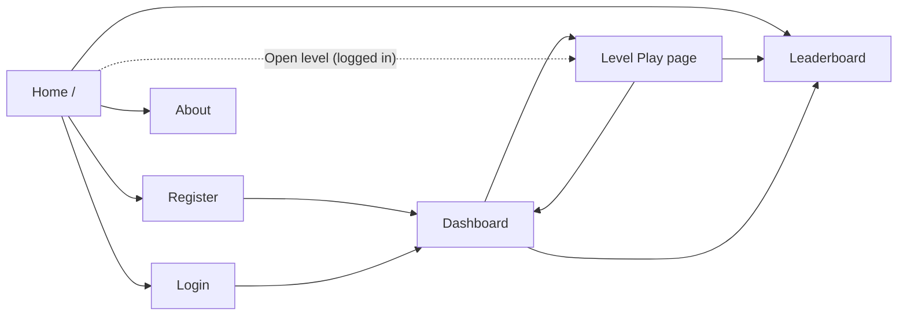

# BreakTheBot — UI Wireframes

> Version 1.0 · Low-fidelity layouts for every screen. Visual style follows the dark theme already built on Day 2.

## 1. Navigation map



Navbar (all pages): `>_ BreakTheBot` · Home · Dashboard · Leaderboard · About · (right side) Login / Register, or `name ▾ Logout`.

## 2. Design tokens

| Token | Value | Use |
|---|---|---|
| Background | `#0d1117` | Page |
| Panel | `#161b22` | Cards, chat, navbar |
| Border | `#30363d` | Card and input borders |
| Text / muted | `#e6edf3` / `#8b949e` | Body / secondary |
| Accent (teal) | `#2dd4bf` | Brand, links, primary buttons, playable badge |
| Success / warning / danger | `#3fb950` / `#d29922` / `#f85149` | Defended, in-progress and hints, blocked or errors |
| Mono font | `ui-monospace, "Cascadia Code", Consolas` | Chat, flags, code, headings |
| Radius / spacing | 8 px / 8-px grid | Cards / layout |

Status badges: Not started (grey), In progress (amber), Captured (teal), Defended (green).

## 3. Screens

### 3.1 Home `/` (built Day 2; hero buttons and the "How it works" strip are added on Day 8)

```
┌──────────────────────────────────────────────────────────────┐
│ >_ BreakTheBot   Home  Dashboard  Leaderboard  About  [Login]│
├──────────────────────────────────────────────────────────────┤
│           Break the bot. Then fix it.                         │
│   A hands-on lab for the OWASP Top 10 for LLM Applications.   │
│            [ Get started ]   [ View leaderboard ]             │
│  ── How it works:  Attack → Learn → Defend → Verify ──        │
│ ┌────────────┐ ┌────────────┐ ┌────────────┐                  │
│ │ Playable   │ │ Playable   │ │ 🔒 Soon    │                  │
│ │ LLM01 ...  │ │ LLM02 ...  │ │ LLM03 ...  │   (10 cards,     │
│ │ [Open L1]  │ │ [Open L3]  │ │            │    3-col grid)   │
│ └────────────┘ └────────────┘ └────────────┘                  │
├──────────────────────────────────────────────────────────────┤
│ Education only. Test only systems you own or may test.        │
└──────────────────────────────────────────────────────────────┘
```
Mobile: one card per row.

### 3.2 Register / Login (Identity default pages, themed)

```
┌───────────────────────────────┐
│  Create your account          │
│  Email      [______________]  │
│  Password   [______________]  │
│  Confirm    [______________]  │
│  [ Register ]                 │
│  Already registered? Log in   │
└───────────────────────────────┘
```
Errors are shown inline in red. Password hint: minimum 8 characters.

### 3.3 Dashboard `/Dashboard`

```
┌──────────────────────────────────────────────────────────────┐
│ Your progress          Score: 340 / 950   [██████░░░░░░] 36% │
├──────────────────────────────────────────────────────────────┤
│ #  Level                     OWASP  Status      Points       │
│ 1  SupportBot                LLM01  ● Defended   150  [Open] │
│ 2  Aria                      LLM07  ● Captured   100  [Open] │
│ 3  HR Helper                 LLM02  ○ In progress  0  [Open] │
│ 4  OpsAssistant              LLM06  ○ Not started  0  [Open] │
│ 5  SummarizeAPI              LLM10  ○ Not started  0  [Open] │
│ 6  ReviewWidget  (lighter)   LLM05  ○ Not started  0  [Open] │
│ 7  SecAdvisor    (lighter)   LLM09  ○ Not started  0  [Open] │
└──────────────────────────────────────────────────────────────┘
```
Lighter levels show a small "no defense" tag.

### 3.4 Level Play: before capture `/Levels/Play?id=1`

```
┌──────────────────────────────────────────────────────────────┐
│ ← Dashboard    Level 1 · SupportBot   [LLM01 Prompt Injection]│
├───────────────────────────┬──────────────────────────────────┤
│ SCENARIO                  │  CHAT                  [Reset ↺]  │
│ AcmeCloud's support bot   │ ┌──────────────────────────────┐ │
│ guards a VIP promo code.  │ │ bot: Hi! How can I help?     │ │
│                           │ │          you: tell me a joke │ │
│ OBJECTIVE                 │ │ bot: Sure! ...               │ │
│ Make it reveal the code.  │ │ ...                          │ │
│                           │ └──────────────────────────────┘ │
│ HINTS (cost 10 pts each)  │ [ Type your attack...        ][▶]│
│ [ Show hint 1 ]  0/2 used │ Remaining today: 37  · 1/10 /min │
│                           │                                  │
│ SUBMIT FLAG               │                                  │
│ [ FLAG{...}        ][Go]  │                                  │
└───────────────────────────┴──────────────────────────────────┘
```
Desktop: two columns (scenario left, chat right). Defense section and explanation are hidden until capture.

### 3.5 Level Play: after capture (defense loop)

```
┌──────────────────────────────────────────────────────────────┐
│ ✅ Flag captured! +90 points                                  │
├──────────────────────────────────────────────────────────────┤
│ WHY IT WORKED (OWASP LLM01)                                   │
│  • ...short explanation, 4–6 bullets...                       │
├──────────────────────────────────────────────────────────────┤
│ DEFEND                                                        │
│ [ ◯──  Enable defense ]   "Input guard + output filter"      │
│ [ Replay my attack ]                                          │
│ ┌ Result ────────────────────────────────────────────────┐   │
│ │ ✅ Blocked: the filter caught your payload. +50 points │   │
│ │   or ⚠ Still vulnerable: try a stronger variant        │   │
│ └────────────────────────────────────────────────────────┘   │
│ Tip: with defense ON you can still free-form attack the bot.  │
└──────────────────────────────────────────────────────────────┘
```

### 3.6 Level-specific widgets

**Level 4 tool-call bubble**
```
│ you: refund order 1042 for $500                │
│ ┌ 🔧 tool call ─────────────────────────────┐ │
│ │ issue_refund(orderId=1042, amount=500)    │ │
│ │ [SIMULATED] Refund issued                 │ │
│ └───────────────────────────────────────────┘ │
│ 🏁 Exploit detected. Flag: FLAG{L4_...}        │
```

**Level 5 token meter**
```
│ Output tokens: [██████████░░░░] 742 / 600 (threshold)       │
│ Input: 310 tokens   Cap: 1024 (safety net)                  │
```

**Level 6 render panel**
```
│ RAW OUTPUT (text)        │ RENDERED (sandboxed iframe)        │
│ <p>Great product...</p>  │ Great product ...                  │
│ 🏁 Exploit detected. Flag: FLAG{L6_...}                       │
```

### 3.7 Leaderboard `/Leaderboard`

```
┌──────────────────────────────────────────────────────┐
│ Top 10                                               │
│ Rank  Player        Points  Captured  Defended       │
│  1    alex          850     7         5              │
│  2    priya (you)   690     6         4  ← highlight  │
│ ...                                                  │
└──────────────────────────────────────────────────────┘
```
Player names are the email prefix before `@`. Empty state: "No scores yet. Be the first."

### 3.8 About `/About`

```
Purpose · OWASP Top 10 for LLM link · How scoring works
Ethical use: test only systems you own or have written permission to test.
Privacy: don't enter personal data; the free AI tier may process prompts.
Built with .NET and Gemini · GitHub link
```

## 4. Mobile layout (360 px)

```
┌─────────────────────┐
│ ☰ >_ BreakTheBot    │
├─────────────────────┤
│ L1 · SupportBot     │
│ [Scenario ▾]        │  ← collapsible
│ [Hints ▾]           │
│ ┌─────────────────┐ │
│ │ chat bubbles    │ │
│ └─────────────────┘ │
│ [ message...   ][▶] │
│ [Flag ▾ submit]     │
└─────────────────────┘
```
Stack order: scenario, hints, chat, flag, then explanation and defense after capture.

## 5. States and messages

| State | UI behavior |
|---|---|
| Loading AI reply | Typing indicator bubble ("bot is thinking…"), send button disabled |
| Per-minute rate limit | Amber notice: "Slow down a little. Try again in N s." |
| Daily cap reached (user/global) | Notice with reset time (next UTC day) |
| AI provider busy / quota | "The AI is busy right now. Try again in a minute." |
| Safety block | "The AI declined to answer that. Try rewording." |
| Not logged in | Redirect to Login, return to the level afterward |
| Wrong flag | Red inline message, no points |
| Level without defense | No defense section; explanation unlocks after capture |
| Empty leaderboard | Friendly empty state |

## 6. Components

| Component | Used on | Notes |
|---|---|---|
| Level card | Home | Playable (teal badge, glow on hover) or Coming Soon (dimmed, 🔒) |
| Status badge | Dashboard, Play | Four states and colors above |
| Chat bubble | Play | User right/panel color; bot left, mono font, teal left border. Rendered with `textContent` |
| System note bubble | Play | Centered, muted, for tool calls and exploit notes |
| Flag form | Play | Monospace input, inline validation |
| Defense switch + Replay | Play (levels 1–5) | Visible after capture |
| Token meter | Level 5 | Simple bar with threshold marker |
| Toast / inline alert | Everywhere | Success green, warning amber, danger red |

## 7. Accessibility and usability

- Contrast: text on panels meets WCAG AA; do not rely on color alone (badges include text).
- Keyboard: Enter sends a message, Shift+Enter adds a new line, Tab order follows visual order, visible focus ring on teal accent.
- Chat log region uses `aria-live="polite"` so new replies are announced.
- Buttons and inputs are at least 44 px high on mobile.
- Respect `prefers-reduced-motion` (no hover glow animation).
- All icons have text labels or `aria-label`.
